# PROJECT Design Documentation

## Team Information
* Team name: Group 2
* Team members
  * Trinity Hampton
  * Anthony Lansing
  * Meghan Tomback
  * Jason Ugbaja
  * Destiny Zeng

## Executive Summary

This is a summary of the project.

### Purpose
Team 2 is working to implement a managment system for the non-profit Animal Shelter *Pawtastic*. This system will provide an interface for 
administrators of *Pawtastic* to manage the needs of the non-profit and for general users to support the non-profit in various ways. 
This includes searching through the needs so that helpers can add them to their baskets and checkout. On the adminstrative side, Admins will be able to communicate through a chat, edit and maintain needs, and view the overall state of the non-profit.

### Glossary and Acronyms
> _**[Sprint 4]** Provide a table of terms and acronyms._

| Term | Definition                        |
|------|-----------------------------------|
| MVP  | Minimum Viable Product            |
| MVC  | Model-View-Controller             |
| API  | Application Programming Interface |
| UI   | User Interface                    |
| DAO  | Data Access Object                |

## Requirements

This section describes the features of the application.

### Definition of MVP
The MVP for this system is to have a login/logout system for users, allow helpers to see, search, and add/remove needs to their basket + check out said basket, allow the reserve username admin to add, remove, and edit needs, and have a helpers basket be saved between login sessions. There also needs to be a level of verficication to ensure each user type only can access what they are permitted to.

### MVP Features
- Cupboard Management
  - Search Needs
  - Add to Basket (Helper)
- Need Editor
  - Edit Need
  - Delete Need
  - Add Need
- Funding Basket
  - Add to Basket
  - Remove from Basket
- Login
  - Create Account
  - Login
  - Logout

### Enhancements
We implemented full-scale authentification with session management and password encryption. We also added management features for the admin only view. These include an admin dashboard that had need and user metrics about the current system. We also had a chat that allowed the admins and super admin to all talk to each other across the site.

## Application Domain

This section describes the application domain.

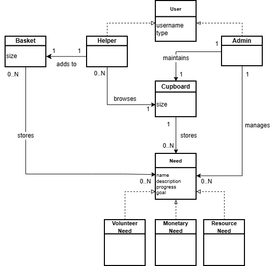

> _**[Sprint 4]** Provide a high-level overview of the domain for this application. You
> can discuss the more important domain entities and their relationship
> to each other._
This application is primarily made up of users and needs. 
Users can be either an admin or a helper.
Needs can be a Volunteer Need, Monetary Need, or Resource Need.
Needs are stored in the cupboard, which helpers can browse and admins can maintain.
Helpers can also add needs to their basket.

## Architecture and Design

This section describes the application architecture.

### Summary

The following Tiers/Layers model shows a high-level view of the webapp's architecture. 
**NOTE**: detailed diagrams are required in later sections of this document.
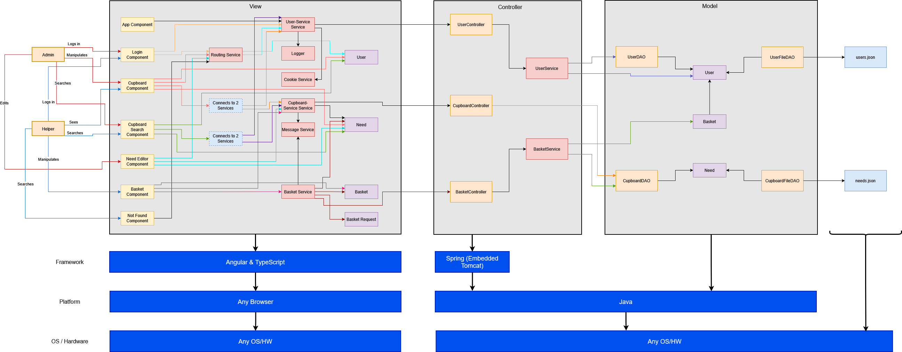

The web application, is built using the Model–View–Controller (MVC) architecture pattern. 

The Model stores the application data objects including any functionality to provide persistance. 

The View is the client-side SPA built with Angular utilizing HTML, CSS and TypeScript. The Controller provides RESTful APIs to the client (View) as well as any logic required to manipulate the data objects from the Model.

Both the Controller and Model are built using Java and Spring Framework. Details of the components within these tiers are supplied below.

### Overview of User Interface

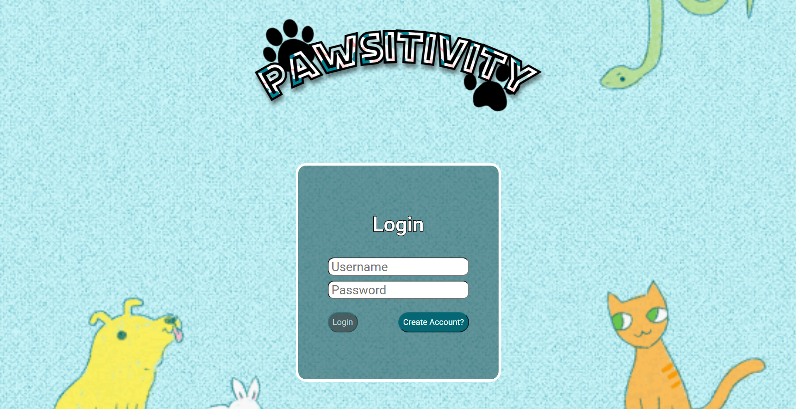
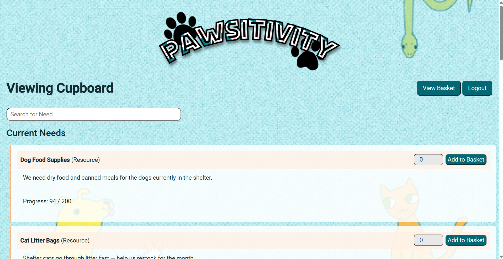
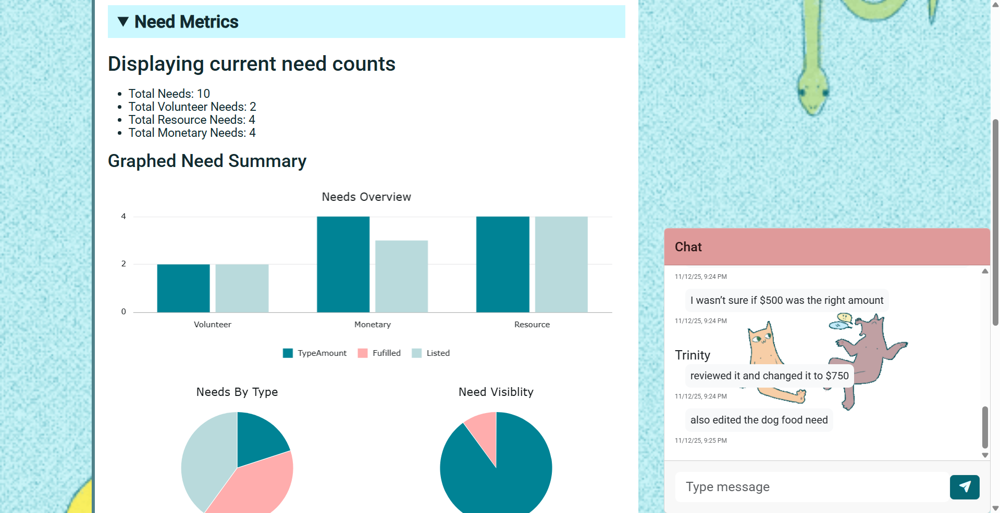

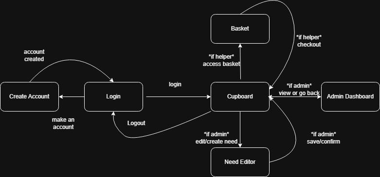

### 
When the user is first brought to the site, they are prompted with the log in page. If they don't have an account there is a button to create an account. After logging in they are brought to the cupboard page where they are shown the list of need that they can search. 
If they are a helper, they can add a quantity of needs to their basket. There is a button to access their basket and on that page they can modify its contents or checkout.
If they are an admin, they will see an edit need button next to each need and also an add need button. All of these options takes them to a need-editor/creation page. After they finish on the need-editor page there is a save/confirm button that will bring them back. Admins also have access to an Admin Dashboard where they can view need and user metrics. Super Admins on this page can also create new Admins. 
On all pages, admins can access and admin chat.
At the end, users can log out and they will be brought back to the login page

### View Tier
Each major user interaction is encapsulated in its own dedicated component, following a modular architecture. Components communicate exclusively with frontend Services, which handle all HTTP communication with the backend. This decoupling simplifies system maintenance and isolates UI logic, user interaction, and network handling. Routing between pages is managed by a routing service that prevents unauthorized access. 

Upon launching the application, users start at the Login Component, where they authenticate with their username and password. Pawtastic supports formal account creation through this component. Validation errors for existing usernames, incorrect passwords, and duplicate accounts are displayed. Successful registration redirects to the login page, while successful login assigns a session cookie that persists across navigation until logout, ensuring consistent user identification.

The application's main page is the Cupboard Component, showing all active Needs published by Pawtastic. Needs appear as compact, visually distinct cards with name, color-coded category, basket quantity for helpers, and a progress bar for fulfillment—a search bar filters by name substring. Helpers and Admins see the same list, but the UI adapts to the user's role, providing role-specific controls and options.

As an Admin and Super Admin, each needs in the cupboard has a “Deslist” and “Edit Need” button. The edit need button opens the need editor component. This component provides a form interface for modifying all attributes of a Need, including its name, description, type, goal, and listing status. Validation is strict, prohibiting invalid input and guaranteeing that modifications to Needs remain valid.  Clicking 'create need' at the top of the cupboard opens the need editor component; however, it displays a blank form rather than prefilled information, maintaining the same validation levels.

The delist need button allows needs to be hidden from public view. Preventing helpers from contributing to those needs and categorizing them into a separate list. Admins can access delisted needs by using the “View Delisted Needs” option. A "Relist" button is now available alongside the edit button. Allowing them to publicize a need.

Admins and Super Admins have additional interfaces not accessible to Helpers. The Metrics Dashboard Component offers a visual analysis of system activities, encompassing Need distribution, user data, fulfillment metrics, and leading contributors. Super Admins possess access to a form within this dashboard that allows them to create new Admin accounts.

Instead of a “Delist” and "Edit" button, Helpers have an Add to Basket Button, alongside a quantity input box. Helpers can enter any valid number; otherwise, the input will be autocorrected. The add to basket button is disabled when an empty or invalid input is entered. 
After adding an need to the basket, helpers can click on the “View Basket” button on the cupboard.

This displays all the Needs they have added to their basket. The UI shows quantity, category, and a subtotal for each item. The basket allows three forms of quantity modification: Increasing quantity, decreasing quantity, and removing a Need entirely. When clicking Checkout, the basket is validated and sent to the backend to update Need progress and clear the basket. A confirmation pop-up message assures the Helper's checkout was successful. Finally, all users can click on the logout button to end their login sessions and return to the login screen.

### Controller Tier
- AuthController
  - Handles queries to the user data for logging in and logging out and account validation
- BasketController
  - Handles needs going in and out of a basket and checkout
- CupboardController
  - Handles needs going in and out of the cupboard, creation/removal
- MessageController
  - Handles the storing and loading of messages for the admin chat
- UserController
  - Handles general queries to the user data

The controller tier acts as the middleman for our application. Every controller is responsible for receiving HTTP requests from the view, validating them, and interacting with the appropriate Services or DAOs to manage the corresponding data. Afterwards, returning a status code and or data corresponding to the request. No controllers interact with or have relations with to other controllers 

> _**[Sprint 4]** Provide a summary of this tier of your architecture. This
> section will follow the same instructions that are given for the View
> Tier above._

> _At appropriate places as part of this narrative provide **one** or more updated and **properly labeled**
> static models (UML class diagrams) with some details such as associations (connections) between classes, and critical attributes and methods. (**Be sure** to revisit the Static **UML Review Sheet** to ensure your class diagrams are using correct format and syntax.)_
> THE ARROWS ON THIS ARE WRONG!!!!!! sprint 4
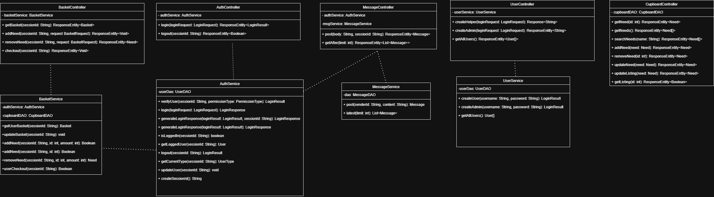

### Model Tier
- Permission Service
  - Handles any controller's method marked with the RequiresPermission annotation to verify proper authentication
- Basket Service
  - Handles the logic operations of modifying and updating the basket 
- User Service
  - Handles the logic operations of modifying or updating user data
- Auth Service
  - Handles the logic operations of password and session authentication  
- Need
  - The abstract parent of all the types of needs provides basic functions for the needs
- Monetary Need, Resource Need, Volunteer Need
  - Specific types of needs will be handled differently for the progress metric
- NeedType
  - Enum to make need classification easier
- User
  - The abstract parent class of the types of users provides basic functions for the users
- Admin
  - Type of user, has more access to cupboard modifications
- SuperAdmin
  -Type of user: can create other admins
- Helper
  - Type of user, can checkout needs and stuff
- UserType
  - Enum to make classification of users easier
- PermissionType
  - Verifies permission types for the user
- RequiresPermission
  - A custom annotation that requires a function to have a certain level of authentication
- LoginResponse
  - An interface that holds data about a login attempt
- LoginResult
  - An enum that has the different outcomes of a login attempt
- Basket
  - Holds needs for a helper

The Model Tier is responsible for defining the core data and logic of our application. Several services handle the system's logic. For example, the AuthService manages password validation and login attempts, returning consistent results, while the Userservice handles creating new users and retrieving user data. This seamless operation is achieved through our class hierarchy via inheritance. The Need hierarchy (Need, MonetaryNeed, ResourceNeed, VolunteerNeed) represents different types of needs with distinct progress behaviors, organized using the NeedType enum. Similarly, the User hierarchy (User, Admin, SuperAdmin, Helper) defines the system’s user roles, supported by the UserType enum for consistent classification. The PermissionType enum enables easy classification of method requirements for authentication and security.

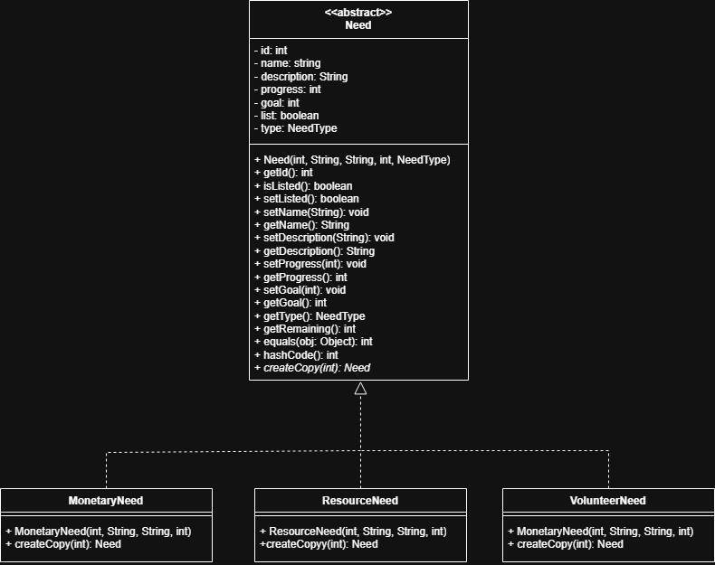
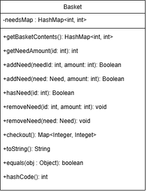
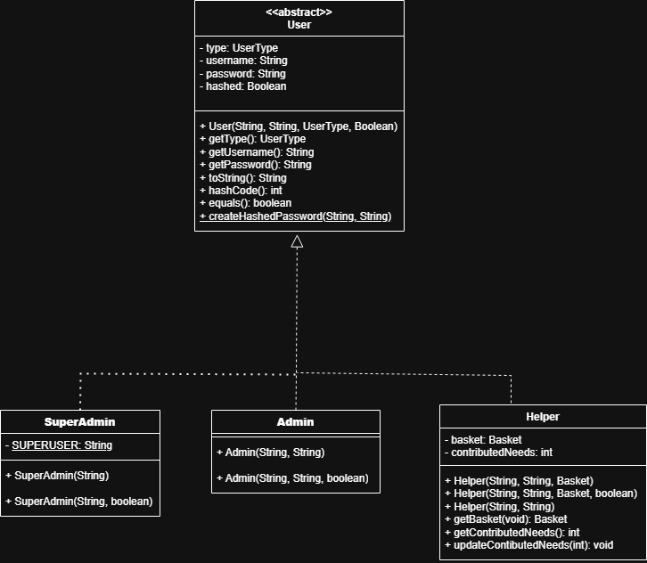
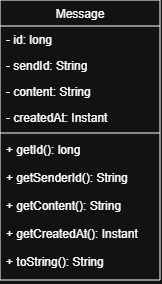

## OO Design Principles
1. Single Responsibility *
  - We made sure each of our classes have a focus responsibility and don't do jobs outside of that responsibility
  - This can be seen in the way we handled the basket in our program. As opposed to having one large basket file that handles everything related to basket, for the API, its split between a model, controller, service, and a request entity. Each of these classes have a specific job and don't overlap responsibility.
    - The Basket class defines what a basket is and provides key access methods for other classes to use. 
    - The Basket Controller handles the interactions with each user's individiual basket
    - The Basket Service handles interactions with the two other services to keep basket operations isolated
    - The Basket Request makes processing data for the baskets cleaner
    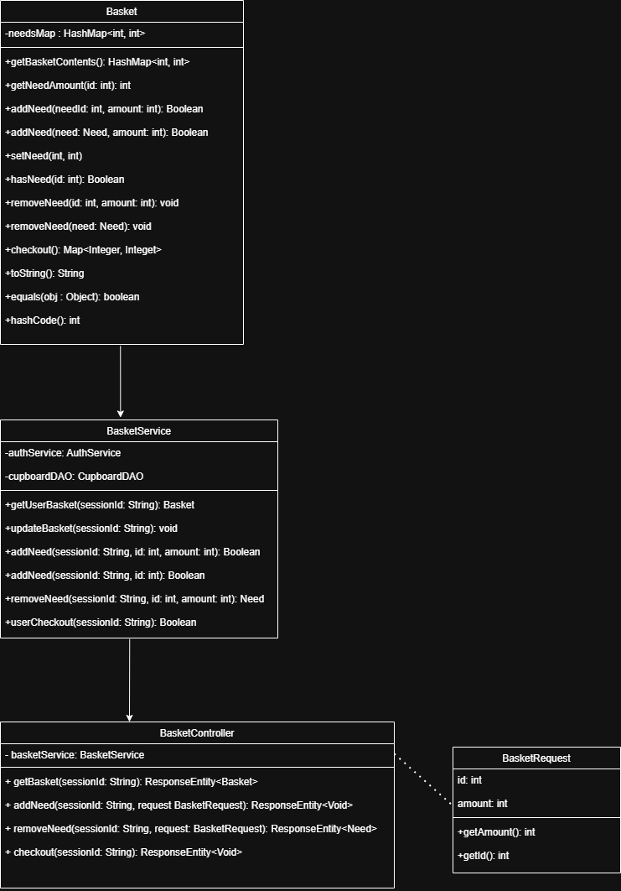
  - This is also prevelant in the UI where we have a basket component and a basket service to keep responsiblities isolated.
    - The Basket Component handles getting the visible elments of the basket and the makes calls to the service based on user input
    - The Basket Service handles the http calls to the api and sends the results to the component
2. Open/Close *
  - We made abstract classes to build child classes upon so that we didn't have one complex class that requires large amounts of maintance
  - The API has abstract implementations for user and need, which are the core parts of our system. Creating these abstract classes allowed us to extend from them and create child classes that we could add functions to depending on their individual type, while still being able to implement blanket functionality for things that apply regardless of type. For user, we have the child classes Helper, Admin, and SuperAdmin. In terms of need, we have VolunteerNeed, MonetaryNeed, and ResourceNeed. 
  - These abstractions are also mirrored on the UI and are used to determine what features are shown to which users, how the needs appear, and allow the information to be sorted for the metrics page. 
  - Diagrams showing the parent and child classes are right above this in the model section
3. Low Coupling
  - We adhered to the rules of abstraction so that we are able to modify the implementation of classes without impacting the rest of the system
4. Information Expert
  - We provided functions that perform the actions using variables in the class the variables belong to
5. Dependency Injection *
  - In the api we have DAO components and services that are injected into the controller so that we have one instance of each class for the system
  - This is also prevelant in the UI tier, where there are also services that are passed into the controllers in their constructor
  - The diagram demonstrates the flow of classes through dependency injection from the cupboard component
  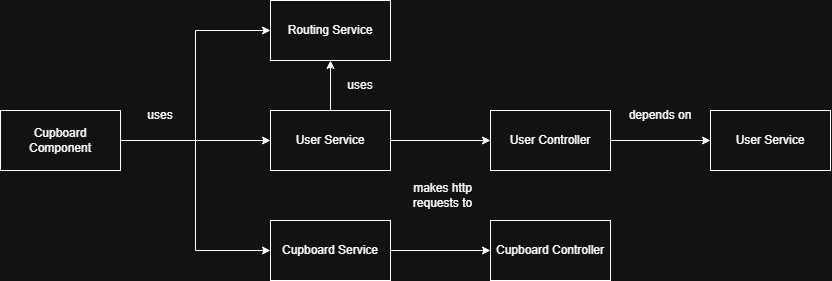
6. Law of Demeter 
  - We made sure to implement our classes so that each class could access the functions and data that they needed directly
  - the services in the ui
7. Controller
  - We implemented controllers so that requests could be handled properly and the correct information could be returned
8. Pure Fabrication
  - We made services to handle buisness logic so that other classes aren't cluttered

> _**[Sprint 4]** Will eventually address upto **4 key OO Principles** in your final design. Follow guidance in augmenting those completed in previous Sprints as indicated to you by instructor. Be sure to include any diagrams (or clearly refer to ones elsewhere in your Tier sections above) to support your claims._

> _**[Sprint 4]** OO Design Principles should span across **all tiers.**_

## Static Code Analysis/Future Design Improvements
> _**[Sprint 4]** With the results from the Static Code Analysis exercise, 
> **Identify 3-4** areas within your code that have been flagged by the Static Code 
> Analysis Tool (SonarQube) and provide your analysis and recommendations.  
> Include any relevant screenshot(s) with each area._

> _**[Sprint 4]** Discuss **future** refactoring and other design improvements your team would explore if the team had additional time._

### Future recommendations and improvements

More vital improvements - 
  * All the functionality of the metrics dashboard is in the frontend.  This was done due to the limited time which led to an attempt to minimize the code needed to   be written and tested for. If this were to be approached again, it should be written like our other classes with a controller, model, and service in the backend. The business logic should not be handled in the frontend for performance and good practice.
  * Don’t use ng
  * Don’t use var, should be using const or let 

Not as vital but just better practice and organization -
  * Clean up one test file

Extra/more trivial improvements that could overall improve user experience - 
  * Super admin can only add admins. If they accidentally misspell a password or username, there is no way to remove them. Super admins should be able to remove admins.
    - Super admin would then need to be able to see a list of all admins with specific username and password info. Could be added to the user metrics section, added as a new page, added as a new section, or a new tab that users could switch to in user metrics
    - Another extra feature - this list could also display specific admin info like what needs they created.
  * Super admin could delete helpers. Would be implemented the same as above.
  * When creating a new account, whether you are a helper or the super admin, implementing an extra text field where users have to retype the password again in that box would help prevent cases where they misspell the password they wanted. Would just be a check to see if the password they typed in both boxes matches exactly. 
  * Helpers could have option to delete their account
  * In chat, the message boxes that are not your own messages can be a little unclear to see since the color is very similar to the background. I would just make them a different color so it’s easier to tell where the outline of the message is.
  * To just follow the 10 usability heuristics, we would be violating help and documentation.
    - In the need editor, the default value for name and description is “Banananananas” and “yummy.” 
      - To follow this principle, having it be something like “Name of need” or “Type name of need here” and the same for description would be more useful. 
      - The goal and progress could also include a “Type quantity of __ here” as well. Currently they are "quantity,” so either change that or just capitalize them to be consistent.
      - Listed also has nothing to explain itself, that is a feature that could be less clear and not as self explanatory to the super admin or admin. Admins might be unclear what listed or unlisted needs are if they’re new to the system. 
        - Provide a brief description of what listed and unlisted needs are next to listed in the need editor page. There is just empty space so there is space.
        - Or add a small question mark box next to listed in the need editor page and display unlisted/listed needs that when users click on it, a small popup next to the question box appears that explains listed and unlisted needs. Would be a popup that users can close out at any time and can still interact with other elements of the page while the popup is up.
  * When super admins create an admin, if they put a username that already exists, they can’t create it but no error message appears saying “username already exists.”
  * When creating a helper account, if you put a username that already exists in create account and then successfully create an account, you’ll be brought to the login and it says account created but the error message “This username is already in use” is still present.
  * Usability heuristic - flexibility and efficiency of use - provide a button in the cupboard for helpers to add max amount of need. Also provide this in a basket as well. 

## Testing
> _This section will provide information about the testing performed
> and the results of the testing._

### Acceptance Testing
> _**[Sprint 4]** Report on the number of user stories that have passed all their
> acceptance criteria tests, the number that have some acceptance
> criteria tests failing, and the number of user stories that
> have not had any testing yet. Highlight the issues found during
> acceptance testing and if there are any concerns._

We have 66 acceptance criteria and as of the Sprint 3 Demo they are all passing to the best of our knowledge. 

### Unit Testing and Code Coverage
> _**[Sprint 4]** Discuss your unit testing strategy. Report on the code coverage
> achieved from unit testing of the code base. Discuss the team's
> coverage targets, why you selected those values, and how well your
> code coverage met your targets._

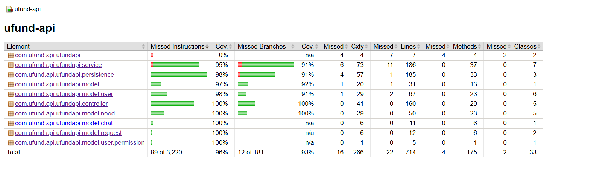

>_**[Sprint 4]** **Include images of your code coverage report.** If there are any anomalies, discuss
> those._

## Ongoing Rationale
>_**[Sprint 1, 2, 3 & 4]** Throughout the project, provide a time stamp **(yyyy/mm/dd): Sprint # and description** of any _**mayor**_ team decisions or design milestones/changes and corresponding justification._

- 9/21/2025 Sprint #1
  - Decided to make a single Need class abstract and have all types of Needs extend from that abstract class and have a single User class abstract so that different User types extend it. This was in order to adhere to the open/closed design principle.
  - Decided to implement CupboardFileDAO for management of the Cupboard separately from the Funding Basket and keep the Basket as a single class. This restricted CupboardFileDAO to a single responsibility and Helper's could each have their own instance of a Basket.
- 9/23/2025 Sprint #1
  - Authentication to be implemented as a service to be handled by UserService. This restricted authentication as a single responsibility by the UserService.
- 10/04/2025 Sprint #2
  - Recieved sprint 1 feedback, decided to verify authentification using a custom annotation, switched to an Atomic Integer for ID, implemented cookies to track what users are logged in 
- 10/21/2025 Sprint #2
  - Decided that the Non-Profit will be an animal shelter and came up with proposal for enhancements: filtering for searches and admin overview of need status
- 11/10/2025 Sprint #3
  - Moved Admin Chat so that it would be visible from all pages, not just the admin dashboard

